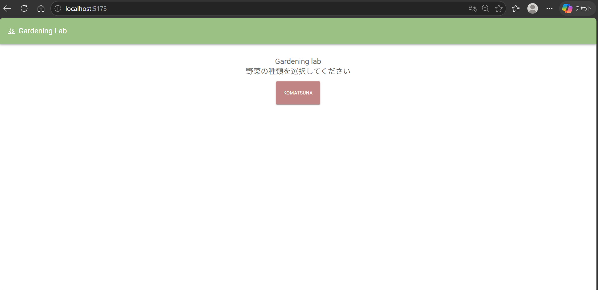
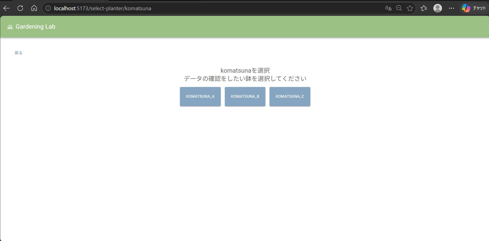
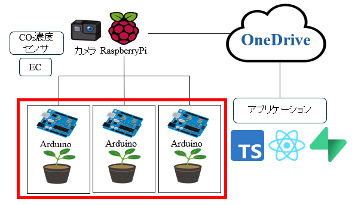
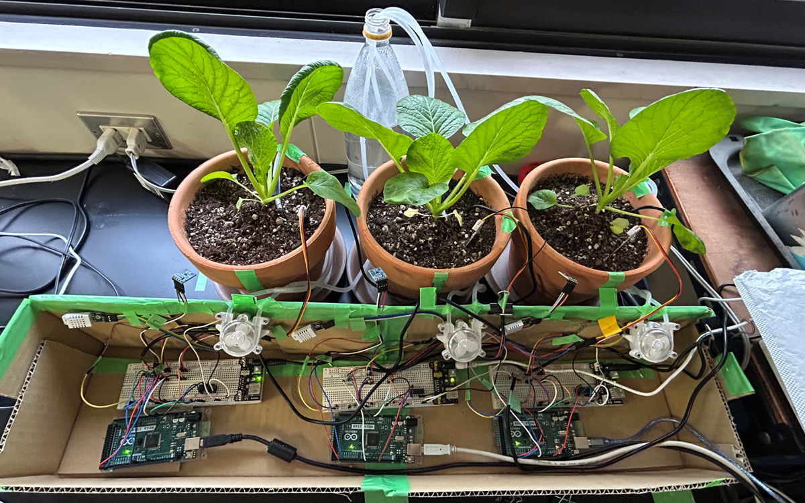

# gardening_lab3

Gardening Lab 3 は、室内植物の生育状況を記録・管理するための統合システムである。環境データ（温度、湿度、CO2）の自動取得、毎日の成長記録、過去データの可視化を通じて、健全な植物育成をサポートする。

## 動作イメージ

https://github.com/user-attachments/assets/859c4c41-ffec-4f7a-9ae9-b62f9afdef3c

## アプリを作ったきっかけ

家庭菜園初心者において辞める人が多いこと、ベランダで栽培していること、時間と相談相手の不足が課題として挙げられ、初心者でも継続的に栽培できる仕組みが必要であると考えた。大学の卒業論文のテーマとし、基礎的研究としてデータの取得からアプリでの表示まで、一通り体系を作りたいと思った。

## 機能

| Topページ                                  | 鉢選択ページ                                                              |
| ------------------------------------------ | ------------------------------------------------------------------------- |
|               |                                           |
| DBに登録済みの野菜が表示されるようにした。 | 1つの植物に対し複数の鉢があることを想定し、鉢ごとに選択できるようにした。 |

|  本日の記録                                                                                             |
| -------------------------------------------------------------------------------------------------- |

 https://github.com/user-attachments/assets/bee111a6-357b-4193-b64a-f34651e691ba

 閲覧日の記録を閲覧時刻に合わせて表示するようにした。閲覧したい日を選択することができる。 

| 1週間の記録                                                                                        |
| -------------------------------------------------------------------------------------------------- |

https://github.com/user-attachments/assets/93736374-759a-4f7d-a824-351e7d442530

 1週間の記録を閲覧できるようにし、時系列で並べたグラフと最大・最小・平均というデータを集計したグラフを選択できるようにした。 

| 写真ページ                                                                                         |
| -------------------------------------------------------------------------------------------------- |

https://github.com/user-attachments/assets/32b86de2-3668-4d92-834d-d734586c5f99 

 写真を表示し、タイムラプス再生を行えるようにしたことで、実感しにくい植物の成長を分かりやすくした。 

## プロジェクト概要

- **frontend**: React + TypeScript + Vite を用いたレスポンシブウェブアプリケーション
- **backend**: Node.js バックエンド（API サーバー、環境センサー連携）
- **目的**: ユーザーが自分の植物の健康状態をリアルタイムで追跡でき、最適な育成環境を実現

## システム構成図

全体の構成  


実際の写真  


## 必要な環境

- Node.js 18.x 以上
- npm 9.x 以上（または yarn）
- Git

## クイックスタート

### 1. リポジトリをクローン

```bash
git clone <repository-url>
cd gardening_lab3
```

### 2. 依存パッケージをインストール

```bash
# リポジトリルートで frontend・backend の依存をまとめてインストール
npm install
```

もしくは個別にインストール：

```bash
cd frontend && npm install
cd ../backend && npm install
```

### 3. 開発サーバーを起動

```bash
# frontend（ポート 5173）
cd frontend
npm run dev

# backend（ポート 3000、別のターミナルで）
cd backend
npm run start:dev
```

ブラウザで `http://localhost:5173` にアクセスしてアプリケーションを確認します。

## 📁 フォルダ構成

```
gardening_lab3/
├── frontend/              # React + TypeScript UI
│   ├── src/
│   │   ├── pages/        # ページコンポーネント
│   │   ├── components/   # 再利用可能なコンポーネント
│   │   ├── api/          # API 連携ロジック
│   │   └── hooks/        # カスタムフック
│   ├── vite.config.ts
│   └── package.json
├── backend/               # Node.js バックエンド
│   ├── src/
│   │   ├── controllers/  # ルーティング・ビジネスロジック
│   │   ├── services/     # ビジネスロジック
│   │   ├── entities/     # データモデル
│   │   └── middleware/   # 認証・エラーハンドリング
│   ├── package.json
│   └── tsconfig.json
├── docs/                  # ドキュメント
│   ├── standards/        # 開発標準・テンプレート
│   └── ...
└── README.md             # このファイル
```

## ドキュメント

- [Frontend README](./frontend/README.md) - フロントエンド開発ガイド
- [Backend README](./backend/README.md) - バックエンド開発ガイド
- [開発標準](./docs/standards/) - Issue/PR テンプレート、コーディング規約

## 開発ワークフロー

1. **Issue 作成**: [GitHub Issues](https://github.com/matsuri002/gardening_lab3/issues) でタスクを作成
2. **ブランチ作成**: `feat/[番号]` ブランチで開発
3. **コミット**: こまめにコミットし、CHANGELOG に記録
4. **PR 作成**: [Pull Requests](https://github.com/matsuri002/gardening_lab3/pulls) でレビューをリクエスト
5. **マージ**: レビュー完了後に main ブランチにマージ

詳細は [docs/standards](./docs/standards/) を参照してください。

## その他

- **ライセンス**: MIT
- **Issue を報告する**: [Issues](https://github.com/matsuri002/gardening_lab3/issues)
- **PR を提出する**: [Pull Requests](https://github.com/matsuri002/gardening_lab3/pulls)

---

**最終更新**: 2026-05-31
